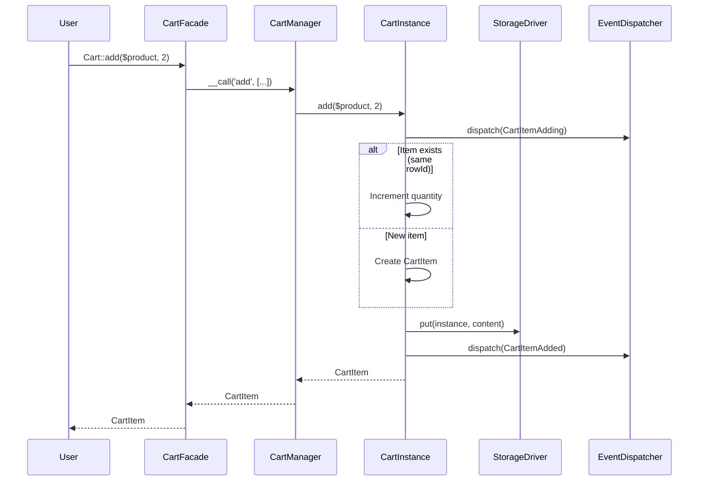
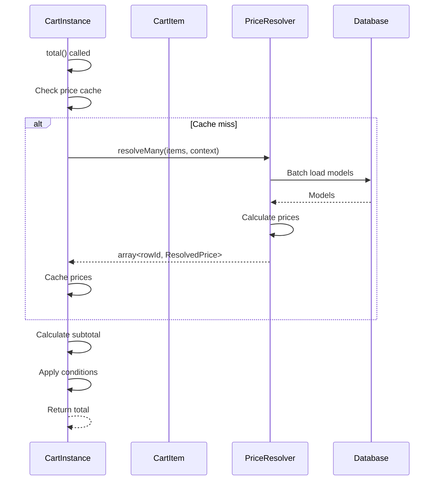
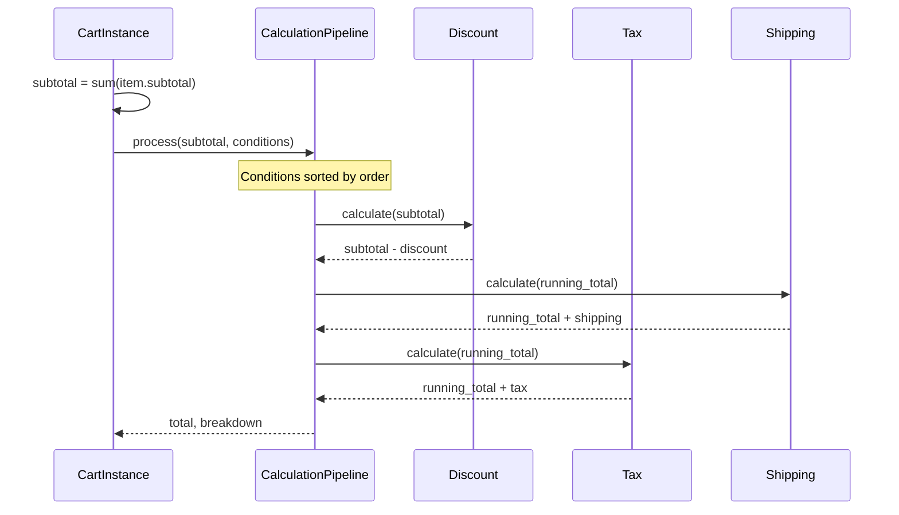
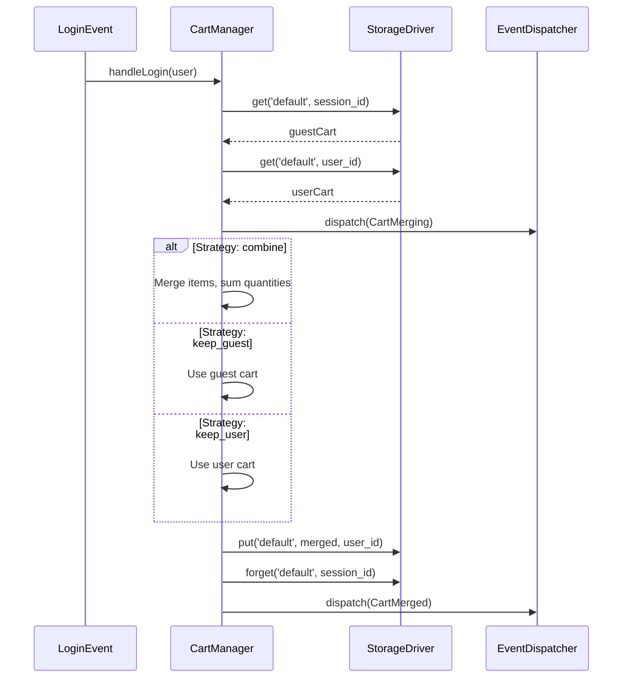

# Architecture Overview

This document describes the high-level architecture of the Cartly shopping cart library.

## Component Diagram

```
+------------------+
|   Cart Facade    |
+--------+---------+
         |
         v
+--------+---------+
|   CartManager    |
| (Singleton)      |
+--------+---------+
         |
    +----+----+
    |         |
    v         v
+---+---+ +---+---+
|Default| |Wishlist|  ... (Cart Instances)
+---+---+ +---+---+
    |         |
    v         v
+---+---+ +---+---+
|Storage| |Storage|      (Storage Drivers)
+-------+ +-------+

         +
         |
         v
+--------+---------+
|  PriceResolver   |
+------------------+
```

## Core Components

### Cart Facade

Entry point for all cart operations. Proxies to `CartManager`.

### CartManager

- Manages multiple cart instances
- Handles storage driver and price resolver selection
- Coordinates user association and cart merging

### CartInstance

- Single cart's operations
- Manages items and conditions
- Calculates totals

### CartItem

- Represents a single cart item
- Contains buyable reference, quantity, options, metadata
- Lazy-loads prices via resolver

### Storage Drivers

- Persist cart data
- Session, Database, Cache, Array implementations
- Pluggable via interface

### Price Resolvers

- Resolve prices at runtime
- No stored prices - always fresh
- Batch optimization support

## Add to Cart Flow



## Price Resolution Flow



## Condition Calculation Flow



## Cart Merge Flow (On Login)



## Storage Layer

```
+------------------+------------------+
|     Instance     |    Identifier    |
+------------------+------------------+
|     default      |     user_123     |
|     wishlist     |     user_123     |
|     compare      |     user_123     |
|     default      |     session_abc  |
+------------------+------------------+
         |
         v
+------------------+
|  StorageDriver   |
+------------------+
| Session: key     |
| Database: row    |
| Cache: TTL key   |
| Array: memory    |
+------------------+
```

## Data Flow Summary

```
User Request
     |
     v
Cart Facade (static proxy)
     |
     v
CartManager (singleton, instance routing)
     |
     v
CartInstance (operations, calculations)
     |
     +---> StorageDriver (persistence)
     |
     +---> PriceResolver (price lookup)
     |
     +---> EventDispatcher (hooks)
     |
     v
Response (CartItem, totals, etc.)
```

## Key Design Decisions

1. **No Stored Prices** - See [ADR-002](adr/002-no-stored-prices.md)
2. **Prices in Cents** - See [ADR-001](adr/001-price-in-cents.md)
3. **Lazy Price Resolution** - See [ADR-003](adr/003-lazy-price-resolution.md)
4. **Multiple Instances** - See [ADR-004](adr/004-multiple-instances.md)
5. **Condition Ordering** - See [ADR-005](adr/005-condition-ordering.md)

## Extension Points

| Component | Interface | Purpose |
|-----------|-----------|---------|
| Storage | `StorageDriver` | Custom persistence |
| Pricing | `PriceResolver` | Custom pricing logic |
| Modifiers | `Condition` | Custom cart conditions |
| Items | `Buyable`, `Priceable` | Custom item types |

## Performance Considerations

1. **Batch Price Resolution** - `resolveMany()` loads all prices in one query
2. **Request-Scoped Cache** - Prices cached for HTTP request lifetime
3. **Lazy Loading** - Models loaded only when accessed
4. **Context Hash** - Skip re-resolution when context unchanged

## Thread Safety

- Each request gets fresh CartManager instance (Laravel container)
- Storage drivers handle concurrent writes (database locks, atomic cache ops)
- No shared mutable state between requests
